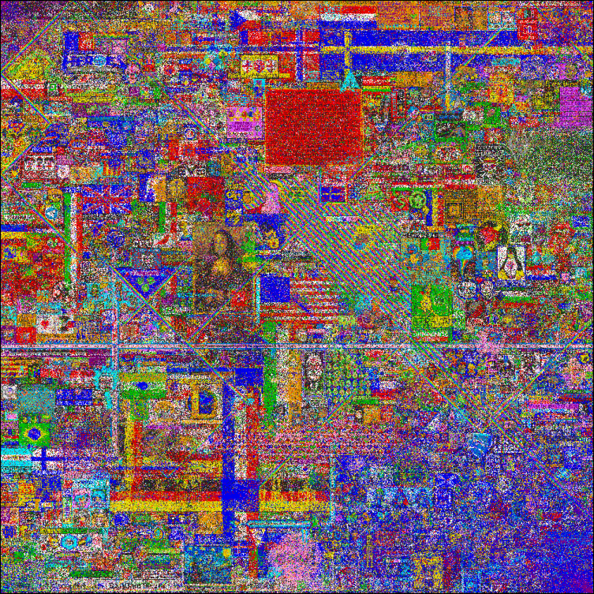
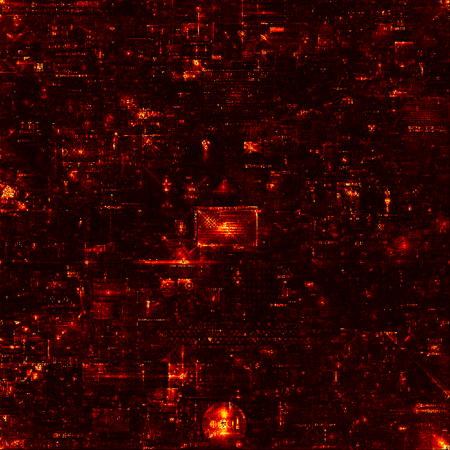
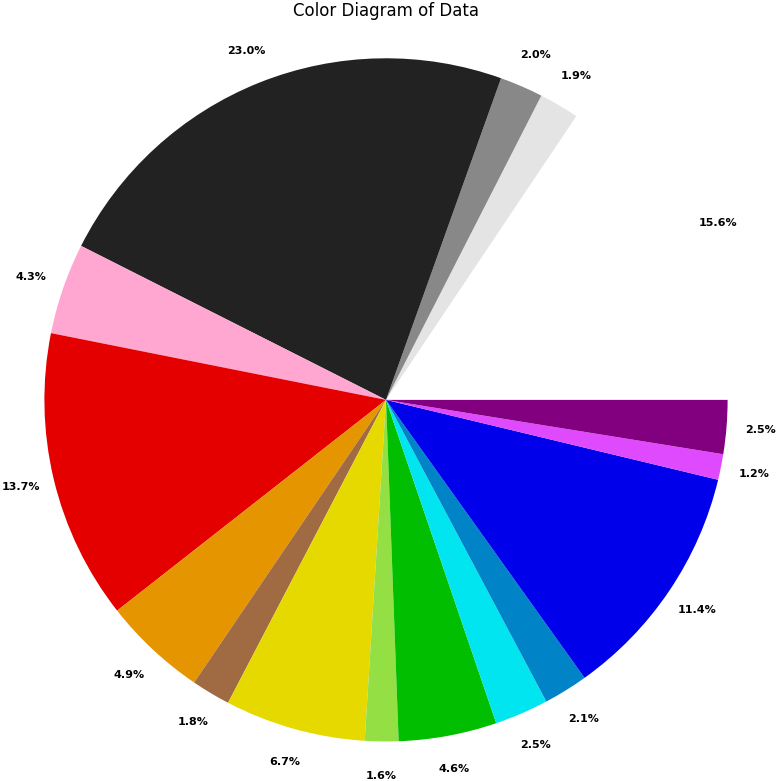

# RPlace Analyzer (for 2017 only)


## Sommaire

- [Introduction](#introduction)
- [Installation](#installation)
- [Utilisation](#utilisation)
- [Observations](#observations)

RPlace Analyzer est un outil permetttant d'analyser les données de l'événement RPlace 2017. Il permet de visualiser les données de l'événement.

## Installation

Pour installer RPlace Analyzer, il suffit de cloner le dépôt git et d'installer les dépendances.

```bash
pip install -r requirements.txt
```

## Utilisation

Pour utiliser RPlace Analyzer, il suffit de lancer le script `main.py` avec un argument correspondant à l'action que vous souhaitez effectuer.

```bash
python main.py -h
```

## Actions

- `-h` ou `--help` : Affiche l'aide
- `-i` ou `--init` : Initialise les données de l'événement (OBLIGATOIRE AVANT TOUTE AUTRE ACTION (sauf -h))
- `-g` ou `--generate` : Génère l'image finale du RPlace
- `-hm` ou `--heatmap` : Génère la heatmap de l'événement
- `-hi` ou `--histogram` : Génère l'histogramme de l'événement (nombre de pixels placés par heure)
- `-co` ou `--color` : Génère le diagramme des couleurs de l'événement

Et c'est tout !

## Observations

- Image final de la RPlace de 2017 :



- Heatmap de l'événement :
    - 
        - Sur cette heatmap, on peut voir que les zones les plus actives sont le centre de l'image et les coins. Cepandant on peut voir que sur la heatmap le drapeau américain est très présent, ce qui veut dire qu'il a été beaucoup modifié / défendu.
        - De même pour le logo rond en bas au milieu, qui a été beaucoup modifié qui semble être le logo de la communauté OSU (qui est en générale très active sur ce genre d'événement).

- Graphique du nombre de pixels placés par heure :

- Diagramme des couleurs de l'événement :
    - 
        - Sur ce diagramme, on peut voir que le noir est la couleur la plus utilisée, suivie du blanc et du rouge. L'utilisation majoritaire du noir peut s'expliquer par le fait que les utilisateurs ont utilisé cette couleur pour effacer des dessins déjà présents ou créer ce que l'on nomme le "Void".

- Liste des utilisateurs/bots participants à l'événement :

