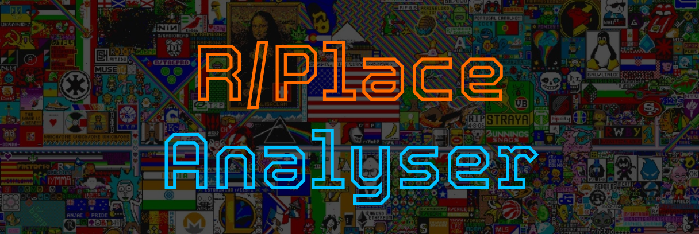

# RPlace Analyzer (for 2017 only)



## Sommaire

- [Introduction](#introduction)
- [Installation](#installation)
- [Utilisation](#utilisation)
- [Observations](#observations)
    - [Image final de la RPlace de 2017](#image-final-de-la-rplace-de-2017)
    - [Heatmap de l'événement](#heatmap-de-lévénement)
    - [Graphique du nombre de pixels placés par heure](#graphique-du-nombre-de-pixels-placés-par-heure)
    - [Diagramme des couleurs de l'événement](#diagramme-des-couleurs-de-lévénement)
    - [Stats en tout genre](#stats-en-tout-genre)
- [Auteurs](#auteurs)
- [License](#license)
- [Remerciements](#remerciements)

RPlace Analyzer est un outil permetttant d'analyser les données de l'événement RPlace 2017. Il permet de visualiser les données de l'événement.

## Installation

Pour installer RPlace Analyzer, il suffit de cloner le dépôt git et d'installer les dépendances.

```bash
pip install -r requirements.txt
```

## Utilisation

**ATTENTION :** Avant d'utiliser RPlace Analyzer, il est **OBLIGATOIRE** de disposer d'une base de donnée MongoDB (sans utilisateur/mot de passe) !

Pour utiliser RPlace Analyzer, il suffit de lancer le script `main.py` avec un argument correspondant à l'action que vous souhaitez effectuer.

```bash
python main.py -h
```

Au premier lancement, un fichier de configuration (pour la connexion avec la DB MongoDB) sera créé. Il suffit de le remplir avec les informations de votre base de donnée.

```yaml
db:
  host: localhost
  port: 27017
```

## Actions

- `-h` ou `--help` : Affiche l'aide
- `-i` ou `--init` : Initialise les données de l'événement **(OBLIGATOIRE AVANT TOUTE AUTRE ACTION (sauf -h))**
- `-g` ou `--generate` : Génère l'image finale du RPlace
- `-hm` ou `--heatmap` : Génère la heatmap de l'événement
- `-hi` ou `--histogram` : Génère l'histogramme de l'événement (nombre de pixels placés par heure)
- `-co` ou `--color` : Génère le diagramme des couleurs de l'événement
- `-u` ou `--users` : Donne le nombre d'utilisateurs ayant participé à l'événement
- `-b` ou `--bots` : Donne le nombre de 'bot'/tricheurs ayant participé à l'événement
- `-mu` ou `--mostuser` : Donne un top 10 des utilisateurs les plus actifs
- `-mp` ou `--mostpixel` : Donne le pixel le plus modifié
- `-lp` ou `--lesspixel` : Donne le pixel le moins modifié

Et c'est tout !

## Observations

### Image final de la RPlace de 2017 :
- 

### Heatmap de l'événement :
- 
    - Sur cette heatmap, on peut voir que les zones les plus actives sont le centre de l'image et les coins. Cepandant on peut voir que sur la heatmap le drapeau américain est très présent, ce qui veut dire qu'il a été beaucoup modifié / défendu.
    - De même pour le logo rond en bas au milieu, qui a été beaucoup modifié qui semble être le logo de la communauté OSU (qui est en générale très active sur ce genre d'événement).

### Graphique du nombre de pixels placés par heure :
- 
    - Sur ce graphique, on peut remarquer que le nombre de pixels placés par heure est très variable.
        - Au début de l'événement, le nombre de pixels placés est très faible, ce qui est normal car le R/Place de 2017 était la première édition de ce genre d'événement.
        - Puis les pics de pixels placés sont chaques jours à 20h, ce qui est probablement dû à la fin des cours / travail pour les utilisateurs.
        - Le pic le plus important est le 2 avril à 20h, au nombre de 401442 pixels placés.

### Diagramme des couleurs de l'événement :
- 
    - Sur ce diagramme, on peut voir que le noir est la couleur la plus utilisée, suivie du blanc et du rouge. L'utilisation majoritaire du noir peut s'expliquer par le fait que les utilisateurs ont utilisé cette couleur pour effacer des dessins déjà présents ou créer ce que l'on nomme le "Void".

### Stats en tout genre :
- Nombre de pixels placés : **16 559 897**
- Nombre d'utilisateurs ayant participé : **1 166 924**
- Nombre de 'bot'/tricheurs (Utilisateur qui a placé des pixels avec moins de 5 minutes d'intervalle) ayant participé : **383 108** *(Valeur étonnante car 32.83% des utilisateurs seraient des 'bots')*
- Nombre de pixels placés par le plus actif : **656** *(0.0039% des pixels (Bot ou pas))*
- Le pixel le plus modifié : **(999, 999)** avec **37 214** modifications
- Le pixel le moins modifié : **(161, 489)** avec **1** modification (Le pixel est noir)

## Auteurs

- [**Wiibleyde**](https://github.com/Wiibleyde)
- [**Alexy845**](https://github.com/Alexy845)
- [**Kaamii**](https://github.com/Joelancel)

[](https://app.codacy.com/gh/Wiibleyde/RPlaceAnalyzer/dashboard?utm_source=gh&utm_medium=referral&utm_content=&utm_campaign=Badge_grade)

## License

Ce projet est sous licence MIT - voir le fichier [LICENSE](LICENSE) pour plus d'informations.

## Remerciements

- [**Reddit**](https://www.reddit.com/r/place/) pour l'événement R/Place
- **The Reddit Admins** pour les données de l'événement
